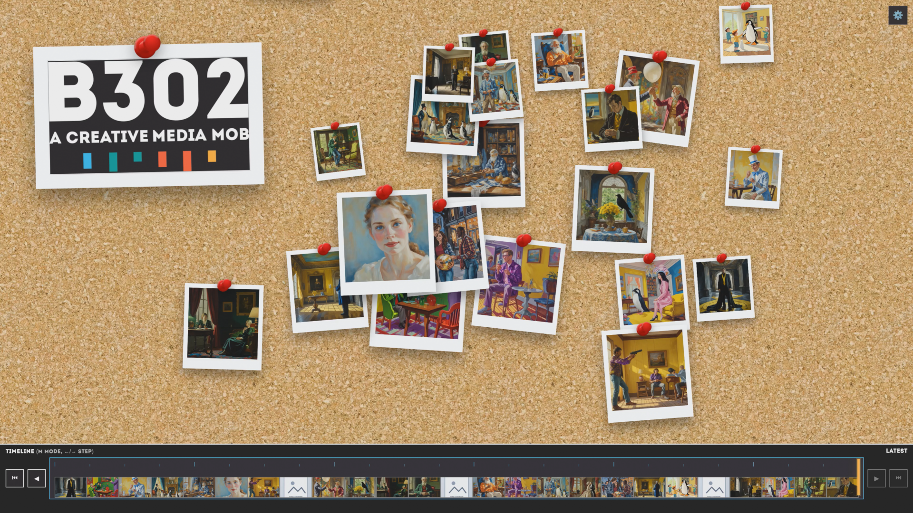

# B302 Innovate 2026 Pinboard

An interactive image wall for the B302 Innovate 2026 experience. Visitors can take a webcam photo, send it through the connected n8n/AI workflow, and see the generated result appear on a shared, zoomable pinboard.



https://github.com/user-attachments/assets/3f6f3935-9257-4ca0-bce7-fa495c48c05f


## What it does

- Lets visitors capture a photo from the browser at `/capture`.
- Forwards captured images to an n8n webhook for processing.
- Shows a “developing” placeholder while the workflow runs.
- Pins finished images to a large draggable, zoomable board.
- Keeps the B302 logo visible as a centerpiece on the board.
- Supports a timeline so the team can scrub through the order images arrived.
- Includes board mode, single-image mode, dark/light themes, image preview modals, and live updates via server-sent events.

## Who it is for

- **Visitors:** take a photo and watch the AI-generated result appear on the wall.
- **Event team:** run the installation on a local network, connect it to the n8n workflow, and monitor new images in real time.
- **Developers:** adapt the Express API, static frontend, and workflow callbacks for future B302 demos.

## Getting started

```bash
npm install
cp .env.example .env
npm start
```

Open the app locally:

- Pinboard: `http://localhost:3000`
- Camera capture: `http://localhost:3000/capture`

The server binds to `0.0.0.0` by default, so devices on the same LAN can open `http://<your-machine-ip>:3000`.

## Configuration

Environment variables are loaded from `.env`:

| Variable | Purpose | Default |
| --- | --- | --- |
| `PORT` | Web server port | `3000` |
| `HOST` | Bind address | `0.0.0.0` |
| `WEBHOOK_URL` | n8n webhook that receives webcam captures | value in `.env.example` |
| `APP_URL` / `PINBOARD_APP_URL` | Public/LAN URL passed to the workflow metadata | unset |

## API overview

### `GET /api/images`

Returns all current board pins, including the persistent B302 logo pin.

### `POST /api/webcam-trigger`

Receives a browser capture and forwards it to n8n.

```json
{
  "imageDataUrl": "data:image/png;base64,...",
  "job_id": "optional-stable-job-id"
}
```

### `POST /api/n8n-updates`

Receives workflow progress for a `job_id`. When the workflow reports it has started, the board shows a temporary generating pin.

### `POST /api/images`

Updates an existing generated pin when the workflow returns a final image URL.

```json
{
  "id": "job-123",
  "imageUrl": "https://example.com/final-image.png",
  "prompt": "optional prompt or metadata"
}
```

### `PATCH /api/images/:id/position`

Persists a dragged pin position and optional `zOrder`.

### `GET /api/images/latest`

Redirects to the latest image. Add `?metadata=1` to receive the JSON record instead.

## Development

```bash
npm test
npm run dev
```

Main files:

- `server.js` — Express server, persistence, API, SSE updates.
- `public/app.js` — interactive pinboard and timeline.
- `public/capture.js` — webcam capture flow.
- `board.json` — local board state.
- `capture-flows.json` — local workflow update history.
